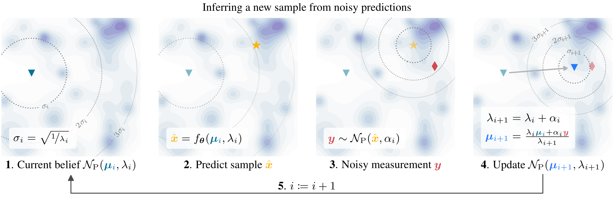

# Bayesian Sample Inference

Marten Lienen, Marcel Kollovieh, Stephan Günnemann

https://arxiv.org/abs/2502.07580

<p align="center"></p>

<p align="center"></p>

## Getting Started

We provide an educational implementation for interactive exploration of the model in [`getting-started.ipynb`](./getting-started.ipynb). The notebook is self-contained, so you can download the file and directly run it on your own computer or [start it on Google Colab](https://colab.research.google.com/github/martenlienen/bsi/blob/main/getting-started.ipynb).

To use BSI with your own model architecture, we recommend that you copy the self-contained [`bsi.py`](bsi/bsi.py) module into your project and you are good to go. The following code snippet shows you how to use the module with your own model and training code.
```python
import torch
from torch import nn
from bsi import BSI, Discretization

class Model(nn.Module):
    def __init__(self):
        super().__init__()
        self.layer = nn.Conv2d(in_channels=4, out_channels=3, kernel_size=3, padding=1)
        
    def forward(self, mu, t):
        t = torch.movedim(t.expand((1, *mu.shape[-2:], len(t))), -1, 0)
        return self.layer(torch.cat((mu, t), dim=-3))

# Use your own model here! Check out our DiT and UNet implementations as a
# starting point.
model = Model()
bsi = BSI(
    model, data_shape=(3, 32, 32), lambda_0=1e-2, alpha_M=1e6, alpha_R=2e6,
    k=128, preconditioning="edm", discretization=Discretization.image_8bit())

from torchvision.datasets import CIFAR10
from torchvision.transforms import v2
from torch.utils.data import DataLoader
transforms = v2.Compose(
    [v2.ToImage(), v2.ToDtype(dtype=torch.float32, scale=True), v2.Normalize(mean=[0.5], std=[0.5])])
data = CIFAR10("data/cifar10", download=True, transform=transforms)

x, _ = next(iter(DataLoader(data, batch_size=32)))
loss = bsi.train_loss(x)
print(f"Training loss: {loss.mean():.5f}")

elbo, bpd, l_recon, l_measure = bsi.elbo(x, n_recon_samples=1, n_measure_samples=10)
print(f"Bits per dimension: {bpd.mean():.5f}")

from torchvision.utils import make_grid
import matplotlib.pyplot as plt
samples = bsi.sample(n_samples=4**2)
img_grid = make_grid(samples, nrow=4, normalize=True, value_range=(-1, 1))
plt.imshow(torch.movedim(img_grid, 0, -1))
plt.show()
```

## Installation

If you want to run our code, start by setting up the python environment.
We use [pixi](https://pixi.sh/) to easily set up reproducible environments based on conda packages.
Install it with `curl -fsSL https://pixi.sh/install.sh | bash` and then run

```sh
# Clone the repository
git clone https://github.com/martenlienen/bsi.git

# Change into the repository
cd bsi

# Install and activate the environment
pixi shell
```

## Training

Start a training by running `train.py` with the your settings, for example
```sh
./train.py data=cifar10
```

We use [hydra](https://hydra.cc/) for configuration, so you can overwrite all settings from the command line, e.g. the dataset with `data=cifar10` as above.
Explore all options in the [`config`](./config) directory, e.g. with `./train.py trainer.devices=4 trainer.precision=bfloat16` you can train on 4 GPUs in 16-bit bfloat precision.

The `cifar10` data module will download the dataset for you, but for `imagenet32` and `imagenet64` you have to download the 32x32 and 64x64 versions yourself from [image-net.org](https://image-net.org/download-images.php) in `npz` format.
Unpack the archives into `data/imagenet32/data` and `data/imagenet64/data` respectively and then run `./train.py data=imagenet32` and `./train.py data=imagenet64` to preprocess them into hdf5 files.

You can re-create our training on, for example, the CIFAR10 dataset with the settings from the [VDM](https://arxiv.org/abs/2107.00630) paper with
```sh
./train.py experiment=cifar10-vdm
```
Use `experiment=imagenet32-dit` and `experiment=imagenet64-dit` for our diffusion transformer configurations on ImageNet.

To submit runs to a slurm cluster, use the `slurm` launcher config, e.g.
```sh
./train.py -m hydra/launcher=slurm hydra.launcher.partition=my-gpu-partition data=imagenet32
```

### Fine-Tuning

To resume training from a checkpoint, pass a `.ckpt` file:

```sh
./train.py from_ckpt=path/to/file.ckpt task.n_steps=128 some.other_overrides=true
```

## Citation

If you build upon this work, please cite our paper as follows.

```bibtex
@article{lienen2024bsi,
  title={Generative Modeling with Bayesian Sample Inference},
  author={Lienen, Marten and Kollovieh, Marcel and G{\"u}nnemann, Stephan},
  year={2025},
  eprint={2502.07580},
  archivePrefix={arXiv},
  primaryClass={cs.LG},
  url={https://arxiv.org/abs/2502.07580},
}
```
